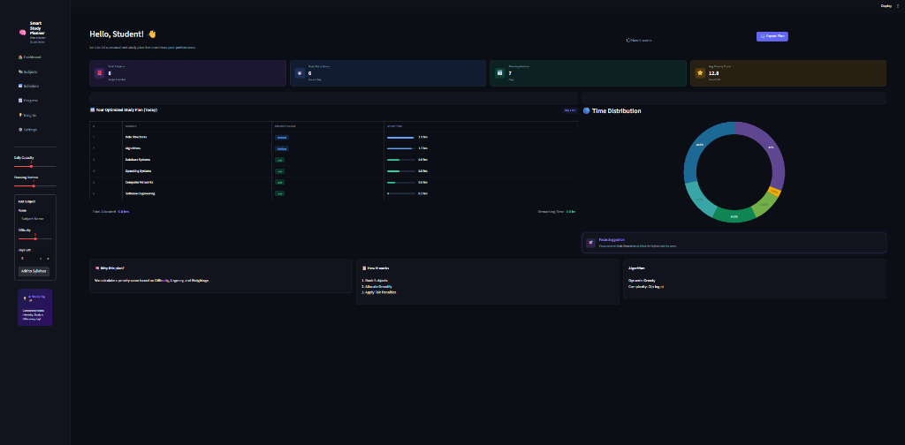

# Smart Study Planner 🧠

A premium, SaaS-style dashboard built with Python and Streamlit that optimizes study schedules using a **Dynamic Greedy Algorithm**.



## 🚀 Key Features

- **Dynamic Greedy Scheduling**: Allocates study hours based on difficulty, urgency, and a fairness penalty to prevent subject burnout.
- **SaaS Dashboard UI**: Dark-themed, glassmorphic interface with color-coded metric cards and interactive intensity heatmaps.
- **Resource Analytics**: Donut charts for time distribution and real-time utilization metrics.
- **Interactive Syllabus**: Add subjects dynamically and re-generate your plan instantly.
- **Exportable Plans**: Download your optimized schedule as a CSV file.

## 📄 Project Documentation
This project includes a detailed academic report covering the algorithm, system design, and implementation.

📥 **Download here:**  
[Smart Study Planner Report](docs/Smart_Study_Planner_Report.pdf)

## 🧠 Algorithmic Thinking: The Dynamic Greedy Model

This project is built around a **Dynamic Greedy Algorithm** designed to solve the multi-objective optimization problem of study scheduling. Unlike a static schedule, this system recalculates priorities in real-time.

### 1. The Heuristic Priority Function
Each subject is evaluated using a custom heuristic that balances **Complexity** and **Urgency**:

$$PriorityScore = (Difficulty \times 3) + \left(\frac{20}{DaysLeft}\right)$$

*   **Difficulty (Weight 3x)**: Acts as the primary driver for effort allocation.
*   **Urgency (Reciprocal of DaysLeft)**: Ensures that as an exam approaches, the subject naturally climbs the priority list, regardless of its difficulty.

### 2. The Dynamic Progress Penalty (Fairness Constraint)
A standard "Greedy" algorithm would simply pick the hardest subject and allocate all hours to it. To prevent burnout and ensure a balanced syllabus, we implement a **Progress Penalty**:

$$DynamicPriority = BasePriority - (AllocatedHours \times 1.5)$$

*   **How it works**: For every hour allocated to a subject, its priority score is temporarily reduced by **1.5 points**.
*   **Result**: This allows other subjects to "catch up" in priority, creating a distributed schedule where the student switches topics naturally throughout the day.

### 3. Allocation Logic (Step-by-Step)
1.  **Block-by-Block Allocation**: Instead of allocating full days, the system works in 1-hour blocks.
2.  **Greedy Selection**: For each block, the system identifies the subject with the *highest current dynamic priority*.
3.  **Feedback Loop**: Once a block is assigned, the subject's penalty is updated, and the list is re-sorted for the next block.

### 4. Complexity Analysis
-   **Time Complexity**: $O(D \cdot H \cdot N \log N)$, where $D$ is total days, $H$ is daily hours, and $N$ is the number of subjects. This ensures the dashboard remains lightning-fast even with large syllabi.
-   **Optimization**: Uses a stable sorting approach to ensure consistency in the schedule.

## 📦 Installation & Usage

1. **Clone the repository**:
   ```bash
   git clone https://github.com/saatvic008/smart-study-planner.git
   cd smart-study-planner
   ```

2. **Install dependencies**:
   ```bash
   pip install -r requirements.txt
   ```

3. **Run the application**:
   ```bash
   streamlit run app.py
   ```

## 🛠️ Tech Stack

- **Frontend**: Streamlit, Custom CSS
- **Visualization**: Plotly Express
- **Logic**: Python (Dynamic Greedy Heuristic)
- **Data**: Pandas
